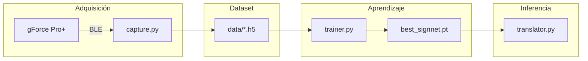

# LSM‑Toolkit

> **Pipeline completo para capturar, entrenar e inferir gestos de la *Lengua de Señas Mexicana* (LSM) usando el brazalete **Oymotion gForce Pro+**. Incluye captura de señales **sEMG + IMU**, entrenamiento de redes neuronales y traducción en tiempo real.**

---

## Índice

1. [Descripción general](#descripción-general)
2. [Requisitos](#requisitos)
3. [Instalación](#instalación)
4. [Estructura de carpetas](#estructura-de-carpetas)
5. [Flujo de trabajo](#flujo-de-trabajo)

   1. [Captura de datos (`capture.py`)](#1-captura-de-datos-capturepy)
   2. [Entrenamiento (`trainer.py`)](#2-entrenamiento-trainerpy)
   3. [Traducción en tiempo real (`translator.py`)](#3-traducción-en-tiempo-real-translatorpy)
6. [Detalles de preprocesamiento y modelo](#detalles-de-preprocesamiento-y-modelo)
7. [Contribución](#contribución)
8. [Licencia](#licencia)

---

## Descripción general

LSM‑Toolkit automatiza el ciclo completo necesario para reconocer gestos de la Lengua de Señas Mexicana a partir de señales musculares (**sEMG**) y movimiento (**IMU**):



* **`capture.py`**: graba señales crudas EMG (250 Hz) y sensores inerciales (IMU, 100 Hz), las sincroniza y almacena en archivos **HDF5** con metadatos.
* **`trainer.py`**: construye un conjunto de datos a partir de los H5, aplica una capa de preprocesado y entrena una red híbrida CNN + Bi‑LSTM con atención.
* **`translator.py`**: recibe streaming directo del brazalete, aplica el mismo preprocesado y emite la clase de gesto más probable cada *n* segundos.

---

## Requisitos

| Componente          | Versión sugerida          |
| ------------------- | ------------------------- |
| Python              | ≥ 3.9                     |
| PyTorch             | ≥ 2.0 (con CUDA opcional) |
| NumPy, h5py, tqdm   | —                         |
| Oymotion gForce SDK | probada con *v0.12.0*     |

> Instala dependencias con:
>
> ```bash
> pip install -r requirements.txt  # Ajusta según tu entorno
> ```

---

## Instalación

1. **Clona** este repositorio y entra al directorio:

   ```bash
   git clone https://github.com/josue-armenta/lsm-toolkit.git
   cd lsm-toolkit
   ```
2. **Configura** un entorno virtual (opcional pero recomendado).
3. **Instala** dependencias Python (ver arriba).
4. **Conecta** tu brazalete gForce Pro+ vía Bluetooth antes de continuar.

---

## Estructura de carpetas

```
lsm-toolkit/
├── capture.py
├── gforce.py
├── trainer.py
├── translator.py
├── preprocessor.py
└── requirements.txt
```

Cada archivo **data.h5** contiene cinco *datasets* (`emg`, `acc`, `gyro`, `euler`, `quat`) dentro de un grupo `raw/`, además de atributos para `phrase_id`, `user_id`, `session_id` y `rep`.

---

## Flujo de trabajo

### 1. Captura de datos (`capture.py`)

```bash
python capture.py \
  --user 1 --phrase 3 --session 1 --reps 10 \
  --address 90:7B:C6:63:4C:B8 --emg-rate 250
```

* Presiona **ESPACIO** para iniciar y detener cada repetición.
* Los archivos H5 se guardan en `data/session_*/user_*/phrase_*/rep_*/data.h5`.

### 2. Entrenamiento (`trainer.py`)

```bash
python trainer.py --root data \
  --classes 3 --epochs 40 --batch 32
```

* Divide automáticamente el dataset en entrenamiento/validación (80 / 20 %).
* Guarda el mejor modelo en `best_signnet.pt` (incluye `num_classes`).

### 3. Traducción en tiempo real (`translator.py`)

```bash
python translator.py \
  --model best_signnet.pt --labels labels.txt \
  --address 90:7B:C6:63:4C:B8 --interval 0.2
```

* Muestra por consola la clase reconocida y su confianza.
* Con `--debug` imprime el *top‑3* de probabilidades y la varianza EMG.

---

## Detalles de preprocesamiento y modelo

| Paso                       | Descripción                                                           |
| -------------------------- | --------------------------------------------------------------------- |
| **Interpolación temporal** | `PreprocessLayer` re‑muestra EMG a 100 Hz para alinear con IMU.       |
| **Concatenación**          | Se combina EMG (8 canales) + IMU (13 features) → tensor `(B, 21, T)`. |
| **Extractores**            | 2× CNN 1‑D + BN + ReLU para aprender representaciones locales.        |
| **Secuencial**             | Bi‑LSTM (2 capas, 64 u.) captura dependencias temporales.             |
| **Atención**               | Pondera la secuencia para obtener un *context vector*.                |
| **Clasificador**           | Capa fully‑connected a `num_classes`.                                 |

---

## Contribución

¡Se agradecen *issues* y *pull requests*!

1. Haz *fork* y crea una rama descriptiva.
2. Sigue el estilo de código (PEP‑8) y añade pruebas si procede.
3. Crea una *pull request* detallando cambios y motivación.

---

## Licencia

Distribuido bajo la licencia MIT. Consulta el archivo [LICENSE](LICENSE) para más información.
